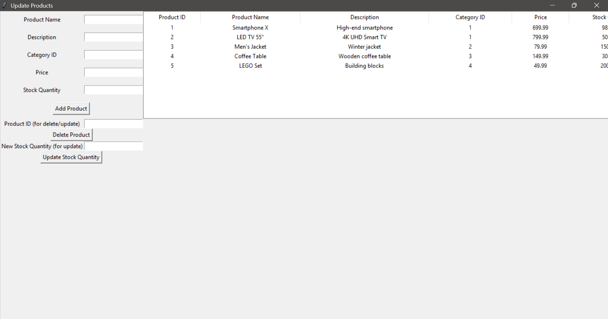

# Inventory Management System (Python + MySQL)

A desktop-based **Inventory Management System** developed using **Python (Tkinter)** and **MySQL**, designed to manage products, track stock levels, and process customer orders through a graphical user interface.

---

## 📌 One-Line Description

A Python-based Inventory Management System using Tkinter and MySQL that enables real-time product management and order processing via a GUI.

---

## 🚀 Features

- Add new products to inventory
- Update product stock quantities
- Delete products from inventory
- View all products in a tabular format
- Create new orders using a cart system
- Automatic stock reduction after checkout
- MySQL database integration
- User-friendly Tkinter GUI

---

## 🛠️ Tech Stack

- **Programming Language:** Python 3  
- **GUI Framework:** Tkinter  
- **Database:** MySQL  
- **Database Connector:** mysql-connector-python  
- **IDE:** PyCharm  
- **Database Tool:** MySQL Workbench  

---

## 🖥️ outputs

### Main Menu

### Update Products

### New Order

